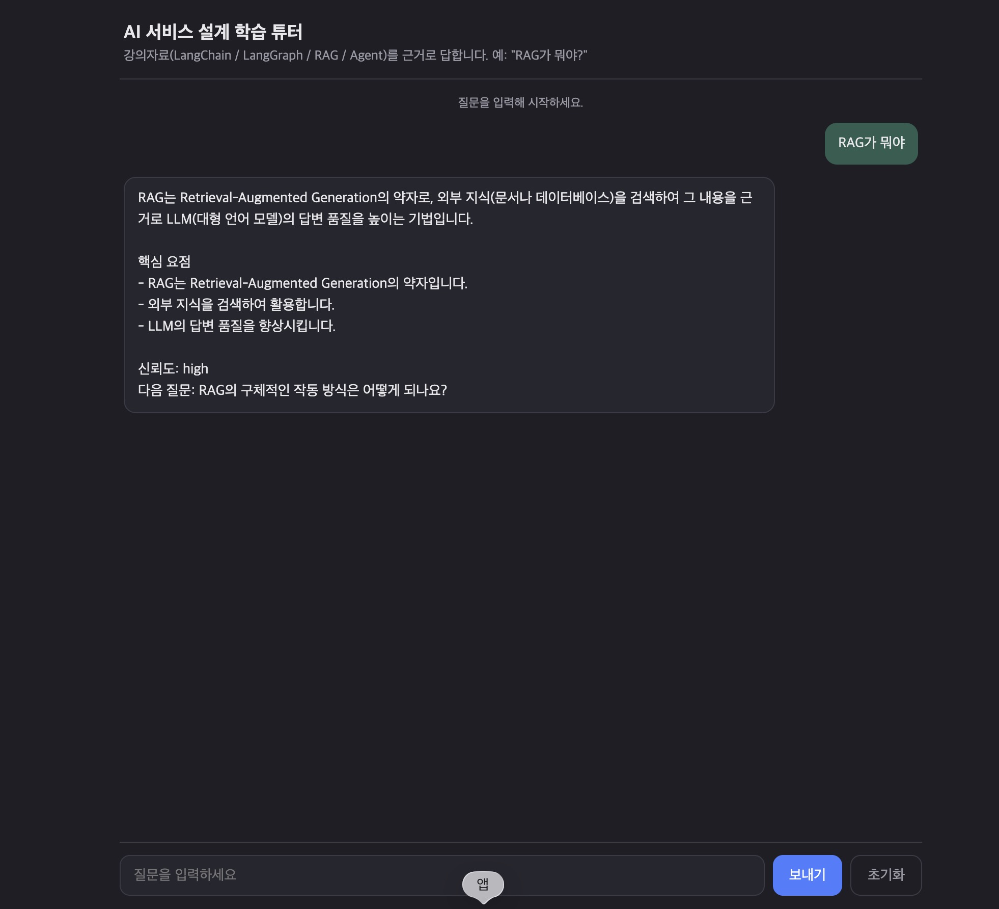

# AI 서비스 설계 학습 튜터


강의자료를 RAG로 검색해 답하는 멀티턴 튜터 에이전트.
LangChain / LangGraph 기반. 

최종 평가 과제 "LangChain 기반 Agent 서비스 구현".

## 서비스 소개

강의 개념을 복습할 때 PDF를 뒤지는 대신 자연어로 물어본다.
강의자료에서 근거를 찾아 답하고, 자료에 없으면 웹을 검색한다. 대화 맥락은 이어진다.

```
질문> RAG가 뭐야?
답변> RAG는 외부 지식을 검색해 근거로 LLM 답변 품질을 높이는 기법이다. (출처: RAG.pdf)
질문> 방금 그거 한 문장으로 요약해줘        (이전 맥락 기억)
답변> ...
```

## 아키텍처

```
사용자 -> main.py(CLI, thread_id)
         -> LangGraph StateGraph
            guardrail -> agent -> tools -> grade -> (rewrite 재검색) -> finalize
         -> Chroma(강의 PDF 임베딩), SqliteSaver(대화 메모리)
```

워크플로우 다이어그램: [docs/workflow.md](docs/workflow.md) (`python main.py --diagram`으로 재생성)

| 파일 | 역할 |
|---|---|
| `main.py` | CLI 엔트리포인트(대화 루프 / `--rebuild-index` / `--diagram`) |
| `server.py`, `public/` | FastAPI 웹 서버 + 채팅 UI |
| `graph.py` | LangGraph StateGraph (분기·반복·구조화 출력) |
| `rag.py` | 강의 PDF -> 청크 -> Chroma 인덱싱 + 리트리버 |
| `tools.py` | rag_search / web_search / course_glossary |
| `guardrail.py` | 가드레일 / 노드 로깅 / 예외처리 |
| `schemas.py` | Pydantic 구조화 출력 스키마 |
| `config.py`, `providers.py` | 설정 로드, OpenAI 모델 생성 |
| `ingest.py`, `pdf_extractor.py` | 인덱싱 CLI, PDF 텍스트 추출 |
| `knowledge/` | 인덱싱 대상 강의 PDF (repo 포함, self-contained) |

## 설치 및 실행

```bash
python -m venv .venv
source .venv/bin/activate          # Windows: .venv\Scripts\activate
pip install -r requirements.txt

cp .env.example .env               # OPENAI_API_KEY 입력 (TAVILY_API_KEY는 선택)

python ingest.py --rebuild         # 강의자료 인덱싱 (최초 1회)

python main.py                     # CLI로 실행
python server.py                   # 웹 UI로 실행 -> http://localhost:3000
```

웹 UI는 FastAPI + 정적 페이지(`public/index.html`)로, CLI와 같은 그래프·메모리를 쓴다.
포트를 바꾸려면 `PORT=8000 python server.py`. Python 3.14 + langchain 1.3 / langgraph 1.2에서 검증.

## 구성 요소

| 요구사항 | 구현 |
|---|---|
| Tool (2개 이상) | `rag_search`(Chroma 검색), `course_glossary`(로컬 사전), `web_search`(Tavily, 선택) |
| RAG | 강의 PDF -> pypdf 추출 -> 청크(1000/150) -> OpenAI 임베딩 -> Chroma. grade 노드가 관련성 평가 후 재검색 |
| Memory | `SqliteSaver` + `thread_id` 멀티턴. `AgentState`로 상태 관리 |
| Middleware | 입력 가드레일, 노드 로깅, `safe_node`/`ToolNode` 예외처리 |
| OutputParser | `GradeDocuments`(분기 판단), `StudyAnswer`(최종 답변) |
| 조건부 분기 | guardrail/agent/grade 3곳 + rewrite 재검색 루프(상한 2회) |

지식원: `knowledge/` 폴더의 PDF. PDF를 추가하면 재인덱싱 시 함께 반영된다.

## 한계 및 개선 방향

- 답변마다 grade·finalize 등 LLM 호출이 많다. 캐싱/스트리밍으로 개선 가능.
- 청킹이 문서 단위라 페이지 출처가 파일명까지만 남는다. 페이지 메타데이터·리랭커 도입 여지.

## 출처

- LangChain, LangGraph, langchain-openai, langchain-chroma, langchain-tavily, Chroma, pypdf, pydantic (MIT/Apache-2.0)
- LangGraph의 Agentic RAG(관련성 평가 후 재검색) 패턴 참고.

보안: `.env`는 `.gitignore` 대상이라 커밋되지 않는다. Public 저장소에 올리기 전 `day*/` 강의노트(.txt)에 실제 키가 없는지 확인할 것.
