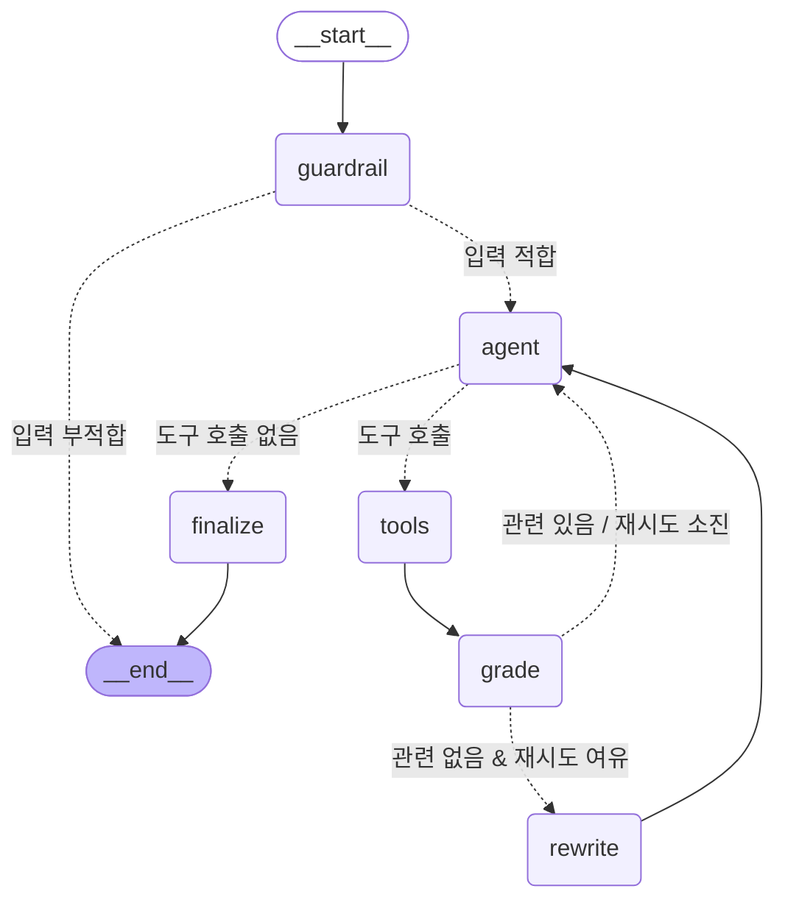

# Workflow 다이어그램

LangGraph `StateGraph`의 실제 컴파일 결과(`graph.get_graph().draw_mermaid()`)를 그대로 옮긴 것입니다.
`python main.py --diagram` 명령으로 언제든 재생성할 수 있습니다.

## 노드 설명

| 노드 | 역할 | 유형 |
|---|---|---|
| `guardrail` | 입력 검증(빈 입력/길이/프롬프트 인젝션 차단). 매 턴 상태 초기화 | Middleware |
| `agent` | 시스템 프롬프트 + 대화 이력으로 **도구 사용 여부를 자율 판단** | LLM(bind_tools) |
| `tools` | `rag_search` / `web_search` / `course_glossary` 실행 | ToolNode |
| `grade` | RAG 검색 결과의 **관련성 평가**(구조화 출력 `GradeDocuments`) | 조건부 분기 판단 |
| `rewrite` | 검색이 부족하면 질의를 재작성해 재검색 유도 | 반복(loop) |
| `finalize` | 최종 답변을 **Pydantic `StudyAnswer`로 구조화** | OutputParser |

## 조건부 분기(conditional edge) — 3곳

1. **guardrail → {agent, END}** : 입력 가드레일 통과 여부
2. **agent → {tools, finalize}** : 도구 호출 필요 여부(`tool_calls` 존재)
3. **grade → {agent, rewrite}** : 검색 결과 관련성 + 재검색 상한(`MAX_RETRIEVALS=2`)

## 반복(loop)

`agent → tools → grade → rewrite → agent` 경로로 **검색이 부족하면 질의를 다시 짜서 재검색**합니다.
무한 루프를 막기 위해 rag 검색 횟수를 `MAX_RETRIEVALS`로 제한합니다.
